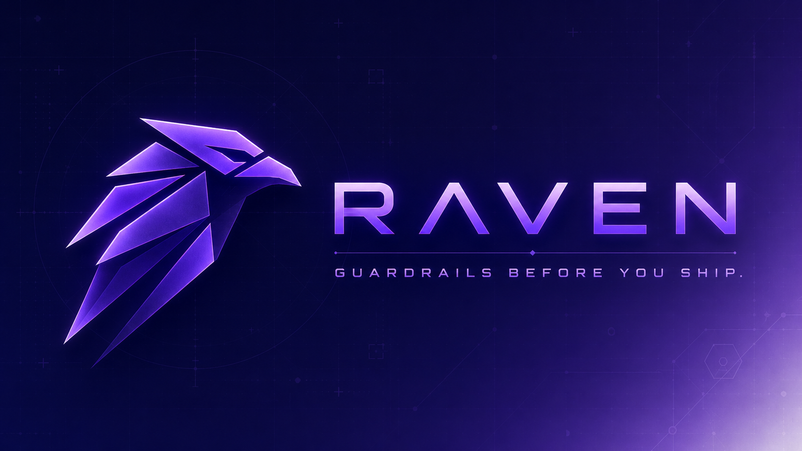

<p align="center">
  
</p>

# Raven v5.0.0 — AI Engineering Control Plane

**Raven is the first open-source AI Engineering Control Plane — built to fight the two things AI coding actually breaks: discipline (code shipping faster than the thinking behind it) and comprehension debt (nobody remembering what the AI wrote, or why). One governed local layer routes each prompt to the right expert, blocks secrets and vulnerable code at the source, meters every token and dollar with verified math, and keeps your team's decisions in a memory that outlives the session.**

AI codes fast. Raven enforces Discipline — Strategic Thinking, Scalable Structure, Security at Source. How, in simple terms:

- **Strategic Thinking** — done by two orchestrators, picked automatically based on what you're doing:
  - **Andie** — for new work and decisions (new repo, new feature, "should we use X or Y?"). Makes a plan, attacks it from three angles (business, technical, data — plus a critic), and waits for your go before touching code.
  - **Andie-Jr** — for bugs in existing code ("why is auth failing?"). Skips the planning ceremony and runs a fast 2-round triage straight to root cause → fix, so brownfield debugging isn't slowed down by process it doesn't need.
- **Scalable Structure** — every prompt is routed to the right expert automatically. 61 specialists, one per domain, picked by deterministic rules — and you always see a one-line note saying who's handling it and why. Works the same on one repo or a hundred.
- **Security at Source** — guards run on your machine, at the moment code is written and committed: secrets are blocked, vulnerable libraries are blocked, and edits are blocked until the thinking actually happened. Not a report after the damage — a gate before it.

All local. Zero telemetry. MIT.

## Install

Raven is **not** in an Anthropic-hosted plugin marketplace — `/plugin marketplace add giggsoinc/raven` will not work. Pick one:

1. **Clone + install** — `git clone https://github.com/giggsoinc/raven.git && claude plugin install ./raven/plugin`
2. **Download zip + install** — grab `raven-plugin-v5.0.0.zip` from [releases](https://github.com/giggsoinc/raven/releases/latest), unzip it, then `claude plugin install /path/to/extracted/plugin`
3. **Let Claude do it** — inside a Claude Code session, ask Claude to clone the repo and run the install command for you (same two steps as Option 1, just delegated)

Full walkthrough (enterprise admin upload, org-wide managed deployment, troubleshooting): [claude_plugin_readme.md](./claude_plugin_readme.md)

Then restart your session. You should see the Raven greeting:

```
🪶 Raven ✅  |  {your-project}  |  {stack}
   Andie is your discipline layer. What are you working on?
```

## Getting Started — After Install

The plugin gives Claude the skills and guards. Each **project** still needs a one-time setup pass for hooks, engine scripts, and a manifest:

```bash
bash <(curl -fsSL https://raw.githubusercontent.com/giggsoinc/raven/main/install.sh)   # once per machine
cd your-project && raven-setup                                                         # once per project
```

Two files come out of this setup, in plain terms:
- **`.raven/manifest.json`** — your project's config card: what language/stack you use, solo or team mode, which guard rules are on. Andie and the guards read this before doing anything, so they act like a Postgres expert on a Postgres project instead of guessing.
- **`.raven/manifest.secrets.json`** — only needed if you want commit/block email or Slack alerts. It holds those notification credentials, is gitignored by default, and everything works fine without it (Raven just skips notifications silently).

### New repo (greenfield)

`raven-setup` finds no file signatures in an empty directory, so it asks 1–3 quick questions (mode: solo/team/enterprise, primary language, cloud provider) and builds `.raven/manifest.json` entirely from your answers. Start working normally — Andie routes every prompt and guards activate as soon as files exist.

### Existing repo (brownfield)

`raven-setup` runs a detector that auto-classifies the work type (code / infra / data / docs / salesforce / odoo / mixed) from file signatures already in your repo. **Known limitation:** that only sets the work-mode label — it does not read `package.json`/`requirements.txt`/etc. to auto-fill the manifest's stack fields, so you'll still be asked to manually pick languages, databases, and cloud provider even though that info is already in the repo. If `.raven/manifest.json` already exists, setup skips straight to "already configured."

This is also where **Andie-Jr** earns its keep: once the manifest is in place, any bug report on this existing codebase gets a 2-round root-cause triage instead of an open-ended investigation — faster than either a from-scratch plan (Andie) or no structure at all (plain Claude).

## Quick start

| You type | What happens |
|---|---|
| `why is auth failing since yesterday?` | routed to **andie-jr** — 2-round triage: root cause → fix → audit note |
| `should we use Postgres or Mongo here?` | routed to **andie** — one mode card, 3-angle review, you approve each step |
| `/andie` or `/andie-jr` | force the route explicitly |
| `git commit` with a staged API key | **hard block** at the pre-commit gate, with the line that triggered it |
| `rename this variable` | routed nowhere — trivial edits skip the ceremony |

## What's included

- **2 orchestrators** — Andie (plan-first, one hard gate, critic voice) and Andie-Jr (brownfield debug, max 2 rounds)
- **Deterministic routers** — repo-state + intent routing with visible one-line toasters; never routes silently
- **61 domain skills** — FastAPI, Postgres, K8s, Terraform, Salesforce, Odoo, Oracle, AWS/GCP/Azure, and more, loaded only when your work matches
- **Local guards** — secret scan + CVE check (CVSS >7 blocks) at every commit; optional edit gate (`raven-skill-gate`, shadow/soft/hard modes); style and architecture checks
- **Cost-aware model routing** — prompts classified to the cheapest adequate tier; secret-laden context forced to a local model
- **Educated Push Gate** — hook-enforced human approval loop: Claude must present a ≤200-word briefing (what/how/files affected) and get your `go ahead` before any file write or mutating command; afterwards it confirms in ≤150 words. First change of each session asks you to pick `guided` (the loop) or `auto` (gate open, you own risk). Read-only research always passes; runs in Python hooks — zero tokens
- **Audit + memory** — JSONL audit logs, session notes, token dashboard ([docs/DASHBOARD.md](docs/DASHBOARD.md)) — all on local disk

## When to Use Raven — Use Case Table

| Scenario | Raven | Plain Claude | Notes |
|----------|-------|-------------|-------|
| **Brownfield bug** — *"Why is auth timing out?"* | ✅ Faster | ❌ | 2-round triage beats open-ended; forces root cause before fix. |
| **Architecture decision** — *"Should we migrate to Postgres?"* | ✅ Better | ❌ | Triad (Functional/Tech/Data) catches angles one perspective misses. |
| **Commit-time security** — prevent secrets/CVEs shipping | ✅ Hard-block | ❌ | Pattern-based detection; reduces risk, not foolproof. |
| **Routine feature work** — *"Build me a login form"* | ❌ Slower | ✅ Faster | Raven adds ceremony; plain Claude is direct. |
| **Quick lookup** — *"What's the CloudRun pricing?"* | ❌ Overkill | ✅ Direct | No decision needed; Raven's routing overhead is wasted. |

---

## Andie + Andie-Jr: The Decision Duo

### Andie (Architecture, Design, Strategy)

Runs a **Drama panel debate** when your decision has tradeoffs:
- **Functional Lead** — business/domain owner perspective
- **Technical Lead** — system/implementation owner perspective
- **Data Lead** — metrics/integration owner perspective

Each panelist argues their angle. You steer the debate. Final output: **decision + rationale + rejected alternatives + risks**.

### Andie-Jr (Brownfield Triage)

For broken systems: **problem → diagnosis → fix → audit**.
- Round 1: 2 clarifying questions that isolate the root cause.
- Round 2: Root-cause explanation + fix + verification steps + audit note.

Not for greenfield builds; only for existing systems showing symptoms (errors, timeouts, regressions).

### Routing Table

| Scenario | Route | How |
|----------|-------|-----|
| **Brownfield bug** ("why is X broken?") | andie-jr | Repo >1 commit + symptom language detected |
| **Greenfield or architecture** ("should we...?") | Andie | Repo ≤1 commit OR Drama-mode intent |
| **Data question** ("what is...?", "list...", "show...") | Direct | No change verbs (build, fix, create); no routing overhead |
| **Force path** (`/andie`, `/andie-jr`) | Explicit | User typed the skill name — routing wins always |

---

## How Raven Works — The Full Stack

### Architecture Overview

```
UserPromptSubmit (every message)
  ↓
triage-router.py [deterministic repo-state]
  ├─ Brownfield (>1 commit) → andie-jr
  ├─ Greenfield (≤1 commit) → Andie
  ├─ Data question (read/list/explain, no change verbs) → direct
  └─ Force path (/andie, /andie-jr) → always wins
  ↓
[Specialist runs, edit/commit allowed]
  ↓
PostToolUse: secret-scan.py (after Write/Edit)
  ├─ AWS keys, OpenAI keys, GitHub tokens, SSH, bearer tokens → WARN
  └─ Send intent to audit log (`.raven/audit/YYYY-MM-DD.log`)
  ↓
Pre-commit hook (.git/hooks/pre-commit)
  ├─ secret-scan.py → HARD BLOCK if secrets staged
  ├─ cve-check.py (new imports) → HARD BLOCK if CVSS >7
  ├─ style-enforcer (line count, type hints, docstrings) → HARD BLOCK if violated
  ├─ architecture-guard (doc alignment) → WARN now, block in 24h
  ├─ db-guard (inline SQL, missing ERDs, migration order) → WARN
  └─ notify.py (SMTP + Slack) → send pass/fail summary + audit
  ↓
Commit lands (or blocked + approval flow starts)
```

### 7 Guard Agents — What They Check

| Guard | Fires | Detects | Action |
|-------|-------|---------|--------|
| **manifest-checker** | SessionStart | Missing `.raven/manifest.json` | Hard stop with setup guide |
| **secret-guard** | PostToolUse + pre-commit | AWS keys, tokens, SSH, PII in staged files | Warn on edit / hard block on commit |
| **cve-check** | New `import X` statement | Library vulnerabilities (CVSS >7) | Warn during coding / hard block at commit |
| **stack-validator** | Import detected + not in approved list | Unapproved libraries (Polars vs Pandas, etc.) | Warn / block at commit |
| **style-enforcer** | File edit | Line count >200, missing type hints, no docstrings | Advise / block at commit |
| **architecture-guard** | New file created | Missing `.raven/architecture.md` documentation | Warn / hard block after 24h grace |
| **db-guard** | File edit (SQL, migrations) | Inline SQL in non-SQL files, missing ERDs, broken migration numbering | Warn in audit log |

### Notifications (SMTP + Slack)

Fires from pre-commit hook on success or block:
- **Commit pass**: Confirmation email + Slack (to recipients in `.raven/manifest.secrets.json`)
- **Commit blocked**: Alert with violation count + Slack
- **Override used**: Log to audit trail + email
- **Token warning**: 75% / 90% thresholds

---

## Tokenomics — What Raven Costs Per Message

**Rule: enforcement runs in Python hooks, outside the model — it costs zero
tokens.** Gates, guards, scanners, audit logs, and the pre-commit pipeline
never enter Claude's context. Only the thin advisory layer does:

| Layer | Frequency | Tokens |
|---|---|---|
| Hooks: skill gate, secret scan, CVE, pre-commit, token guard | every tool call / commit | **0** |
| Skill-reminder + router toasters (context injection) | per message | ~100 |
| Session boot (greeting + transparency banner) | once per session | ~500 |
| Specialist SKILL.md load (when a skill actually runs) | once per session | ~1–2k |
| Violation messages (block/warn) | only on violation | ~50 |

Steady-state: **~2% overhead** on a typical session — and the model router
(0-token hook) claws that back by tiering simple prompts to cheaper models and
routing secret-laden context to a free local model. Full breakdown, including
where Raven saves tokens: [docs/TOKENOMICS.md](docs/TOKENOMICS.md) ·
diagrams: [business view](docs/Agent_token_architecture_business.html) ·
[technical view](docs/Agent_token_architecture_tech.html).

---

## Features by Version

### **Raven v5.0.0** (Current) — Discipline Fix Chain
The engine applied to itself: unified script trees + CI drift gates, docs-vs-reality enforcement (PostToolUse guards wired for real), canonical hook config with generated distribution copies, 62-skill ownership registry, honest model-router disclosure + /router toggle, dual-path cost verification, per-model cost log, and the raven-xray Code Map. Full details: VERSIONLOG.md.

### **Raven v4.3.0** — Tokenomics Metering + Vibe-Coder Dashboard

**New:**
- **Token metering** — `token-meter-write.py` Stop hook records tokens, cost, and call counts per session (session JSON + monthly rollup + audit log). Session-end meters printed in-terminal.
- **Dashboard upgrade** — local HTML dashboard (`~/RavenVault/dashboard.html`) now shows tokenomics with a Raven-metered vs Claude-reported cost comparison. See [docs/DASHBOARD.md](docs/DASHBOARD.md).
- **Knowledge-graph icons** — picture-map UI for non-programmers; SVG icons inlined for offline `file://` use. Zero-code guide: [docs/VIBE-CODER-MAP.md](docs/VIBE-CODER-MAP.md).
- Andie v6.4 (one hard gate, implicit GO, GATES ledger, critic voice) + routing toasters — Raven never routes silently.

### **Raven v4.2.0** — RavenVault Knowledge Graph & Agent Memory

- Vault-backed cross-session memory with graph export; see [docs/CHANGELOG-4.2.0-vault-graph.md](docs/CHANGELOG-4.2.0-vault-graph.md) and [docs/RAVENVAULT-GRAPH-AND-MEMORY.md](docs/RAVENVAULT-GRAPH-AND-MEMORY.md).

### **Raven v4.1.0** — Privacy + Routing Hardening

**New:**
- Privacy hardening: Changelog cleared from manifest, personal emails replaced with org email across all registries.
- **Critical routing fix**: Deterministic repo-state logic replaces regex classification. Brownfield →andie-jr, greenfield → Andie, data questions → direct. Fixes misclassification of debug as new-work.

**Maintained from v4.0:**
- Andie Drama mode (3-panelist debate on tradeoffs)
- Andie-jr fast triage (2-round root-cause flow)
- 61 domain skills (ML, Salesforce, Odoo, K8s, Terraform, etc.)
- Commit-time secret + CVE scanning
- Cross-session memory (`.raven/memory/`)
- SMTP + Slack notifications

### **Raven v4.0.0** — Honesty Pass + First Release

- Rewritten README: no false claims, honest ROI section, per-persona messaging.
- Verified 61 skills (corrected from earlier miscount).
- CLAUDE.md per-turn discipline contract at top; Raven/Lucky gate; real hook names.
- First onboarding in Andie: brownfield self-detect vs greenfield setup (≤2 questions).
- `/andie` + `/andie-jr` force-path commands; plugin now bundles 12 commands.
- `notify.py`: real SMTP + Slack wired into pre-commit.
- `install-claudemd.py`: append-only CLAUDE.md installer (never deletes user content).
- Session-start transparency banner.

### **Previous Versions**

See [CHANGELOG.md](CHANGELOG.md) for v3.x and earlier.

### Upgrade Path

- **v4.0 → v4.1**: Drop-in replacement. Run `/raven-sync` to sync manifests; no config changes needed.
- **v3.x → v4.0+**: Not backward-compatible. See migration guide in CONTRIBUTING.md.

---

## Other Install Paths

**Claude Desktop (ZIP):** download [`raven-plugin-v5.0.0.zip`](plugin/raven-plugin-v5.0.0.zip) → Settings → Extensions → Add plugin → drop the ZIP → restart.

**From source:**

```bash
git clone https://github.com/giggsoinc/raven.git
cd raven && bash plugin/make-plugin.sh   # builds plugin/raven-plugin-v5.0.0.zip
```

---

## Contributing

Raven is MIT licensed. Contributions welcome. See [CONTRIBUTING.md](CONTRIBUTING.md) for:
- How to add a skill
- How to write a guard agent
- Style standards (Giggso code style — type hints, docstrings, logging, ≤200 LOC per file)
- Pre-commit hook requirements

---

## Raven Enterprise

This repo is the **free tier — everything runs local**, MIT-licensed, complete as-is.

**Raven Enterprise** (paid, sold separately) adds what teams and compliance departments need on top: Hub dashboards across developers and repos, per-developer token attribution and chargeback, compliance/audit reporting, centralized policy sync, and commercial support.

→ [giggso.com](https://giggso.com)

---

## Support & Issues

- **Bug reports**: [GitHub Issues](https://github.com/giggsoinc/raven/issues)
- **Questions**: Start a discussion in [GitHub Discussions](https://github.com/giggsoinc/raven/discussions)
- **Security vulnerabilities**: Email `rv@giggso.com` (do not open public issue)

---

<p align="center">
  <strong>Built by <a href="https://giggso.com">Giggso</a> · <a href="https://github.com/giggsoinc/raven">GitHub</a> · MIT License</strong>
</p>

*Raven v5.0.0 — Governance for AI coding at the speed of thought.*
